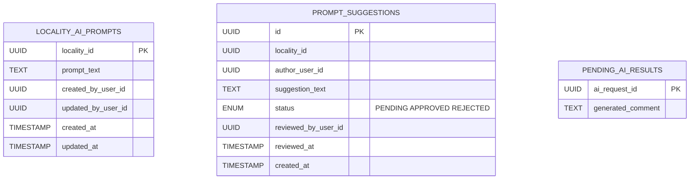

```mermaid
erDiagram

    LOCALITY_AI_PROMPTS {
        UUID locality_id PK
        TEXT prompt_text
        UUID created_by_user_id
        UUID updated_by_user_id
        TIMESTAMP created_at
        TIMESTAMP updated_at
    }

    PROMPT_SUGGESTIONS {
        UUID id PK
        UUID locality_id
        UUID author_user_id
        TEXT suggestion_text
        ENUM status "PENDING APPROVED REJECTED"
        UUID reviewed_by_user_id
        TIMESTAMP reviewed_at
        TIMESTAMP created_at
    }

    PENDING_AI_RESULTS {
        UUID ai_request_id PK
        TEXT generated_comment
    }
```
